# RunIt

## 프로젝트 배경

## 기능 소개

### 로그인
---
#### 카카오 소셜 로그인
- 카카오 소셜 로그인을 통해 가입 및 접속이 가능합니다.

### 자동 로그인
- 로그인 정보가 있으면 자동 로그인이 가능합니다.

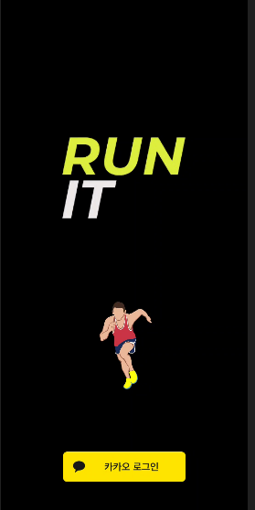

### 메인 화면
---

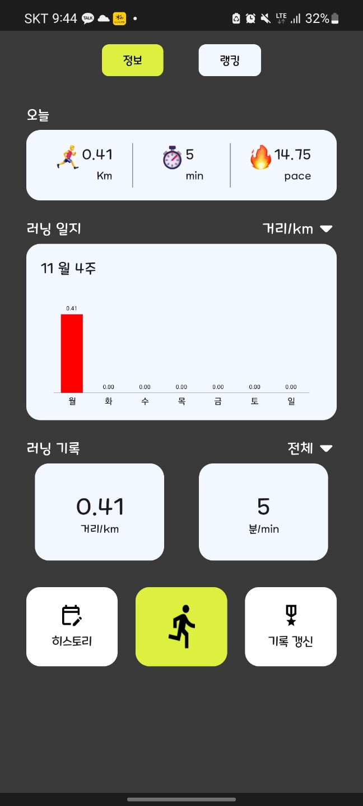

#### 오늘 기록
- 오늘 달린 거리, 시간, 평균 페이스를 볼 수 있습니다.

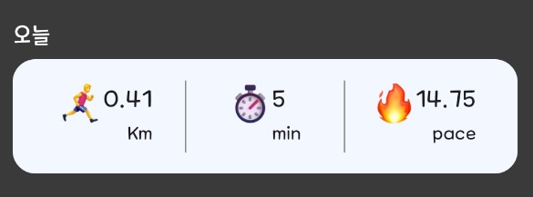

#### 러닝 일지
- 거리, 시간, 페이스 드롭다운 메뉴를 통해 일주일 데이터를 그래프로 확인할 수 있습니다.

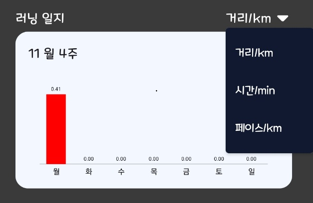

#### 러닝 기록
- 전체, 일주일 드롭다운 메뉴를 통해 총 기록을 확인할 수 있습니다.

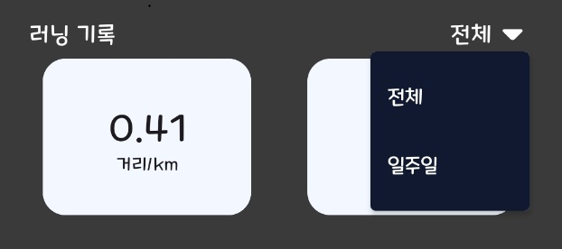

### 랭킹
--- 

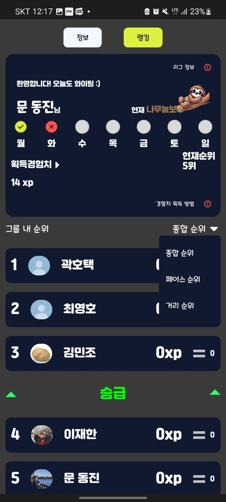

#### 사용자 정보
- 일주일 간 달린 기록 확인이 가능합니다.
- 현재 어느 리그인지 확인 할 수 있습니다.
- 그룹 내 순위를 확인 할 수 있습니다.

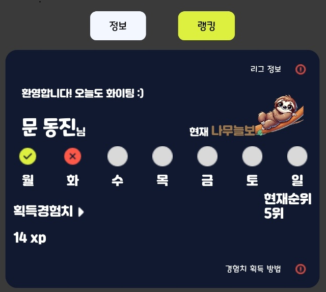

#### 순위 정보
- 종합 순위 : 경험치 정보를 통한 순위를 확인 할 수 있습니다.
- 페이스 순위 : 페이스 기록을 통한 순위를 확인 할 수 있습니다.
- 거리 순위 : 거리 기록을 통한 순위를 확인 할 수 있습니다.

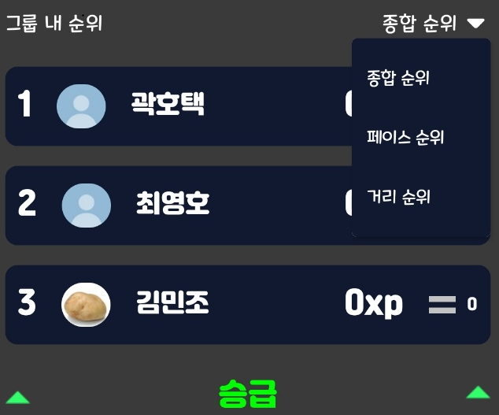

#### 리그 정보

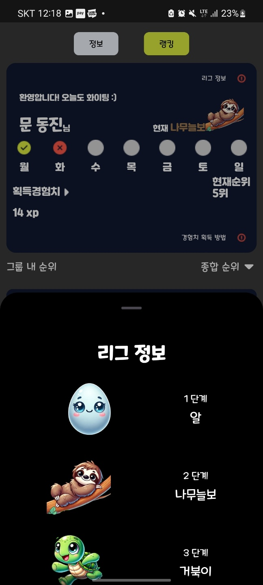

#### 경험치 획득 방법

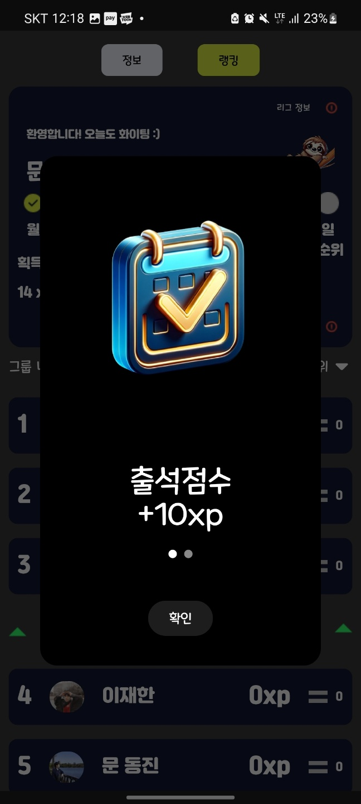

### 히스토리 
---
#### 히스토리 달력
- 불 아이콘을 통해 달린 날짜를 확인할 수 있습니다.
- 날짜 및 아이콘을 클릭해 그날의 런닝 기록 리스트를 확인 할 수 있습니다.

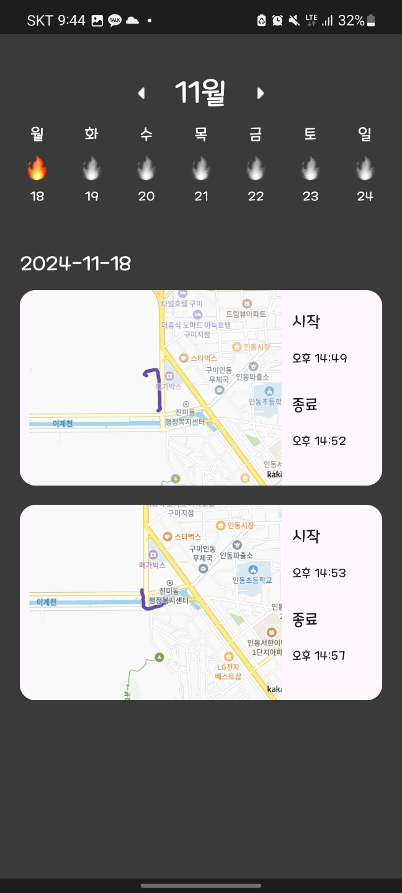

#### 히스토리 기록 상세
- 리스트의 정보를 클릭하면 상세 정보를 확인할 수 있습니다.

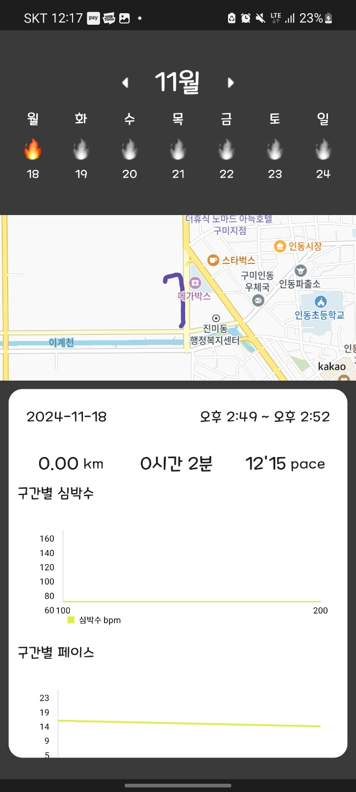

### 기록 갱신
---
#### 연습 모드 리스트
- 등록한 연습 모드 리스트를 확인 할 수 있습니다.

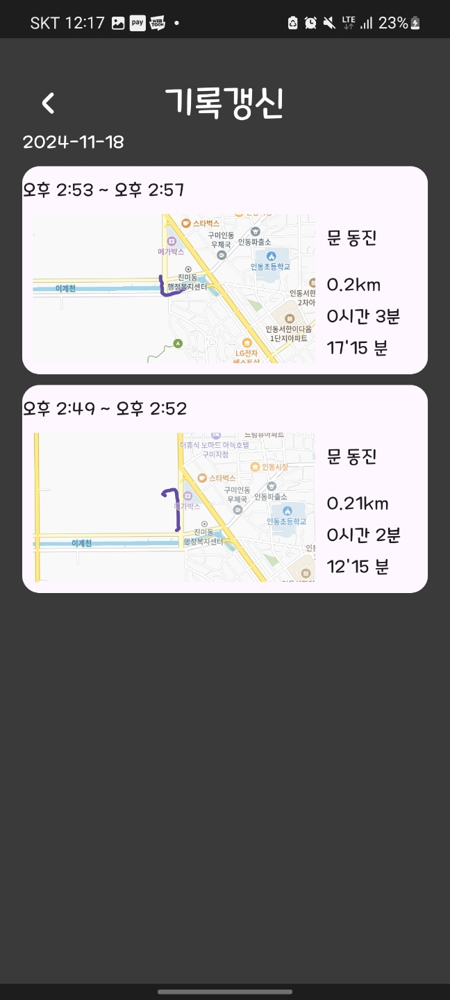

#### 연습 모드 상세
- 연습모드 리스트를 클릭하면 상세 정보를 확인할 수 있습니다.
- 도전하기를 통해 과거의 나의 데이터에 도전할 수 있습니다.

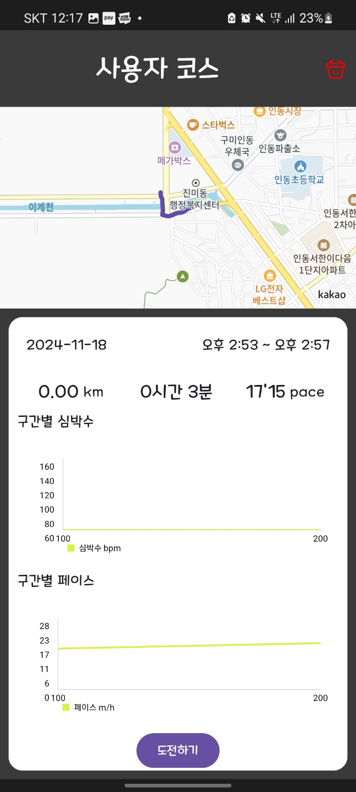

### 런닝
--- 
#### 런닝하기
- 시간, 거리, 페이스를 확인 할 수 있습니다.
- 와치와 연동하여 BPM 정보를 확인 할 수 있습니다.
- 100m 이상 런닝 시 정지 버튼을 통해 결과를 저장할 수 있습니다.
- 현재까지 뛰었던 경로를 확인할 수 있습니다.
